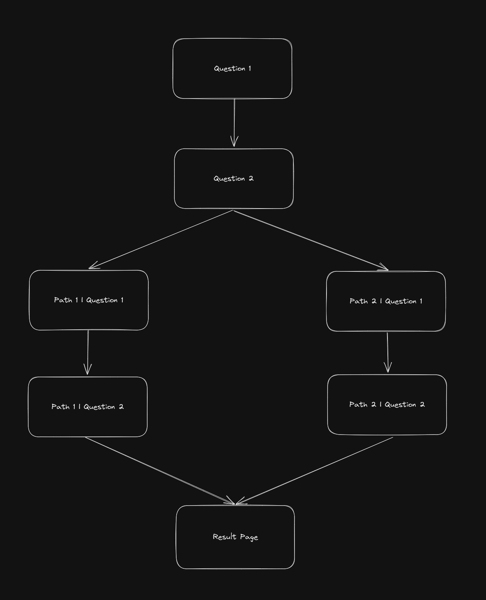

# Frontend Developer (m/w/d) @OofOne Takehome

As part of our application process, we'd like to see what you can produce by giving you a small assignment. It should take you no more than a few hours to complete the assignment, but any extra polish or features you might want to put in will not go unnoticed.

## The assignment

We would like you to create an interactive form with the following structure:

You can choose the questions to ask yourself, the only requirements are:

- The user should be routed to path 1 or path 2 **depending on their answer to both question 1 and 2** (e.g. Q1: "Pick a number", Q2: "Pick another number" => If num 1 + num 2 > 5, go to path 2, else use path 1). The inputs don't have to be numbers, you can get creative here.
- The form should include **at least one** date input, number input and text input respectively.
- The result the user sees should depend on their answers to the **general questions** (Q1 and Q2) + **the answers to the questions in their chosen path**. E.g. the answers to Q1 and Q2 are numbers, the user got path 2 and therefore answered one date and one text question. The result shows a prediction of the users future by incrementing the chosen date by the sum of Q1 and Q2 and appeding their text answer, completing to a text like: "On 01.01.2030, my biggest wish will happen".
  01.01.2030 and "my biggest wish" being derived from the previous answer inputs.
- Only one question should be rendered at a time.
- Ability to navigate forwards and backwards between questions.

You can style the form in whatever way you prefer, it does not have to be beautiful (but there will be bonus points if it is).

Once the form is completed, please send the result to a simple Next endpoint using axios or fetch and print it in the backend handler.

#### Extra credit features

- Search through given Q&As on the result page with the option to jump to a form question
- Polish and UX
- Ability to easily add questions/extend the Code
- Tests

## Requirements

You may choose whatever technologies you prefer, while encorporating the following:

- Next.js
- TypeScript

For styling anything from vanilla CSS to Tailwind is fine, but please do not use any component libraries like Bootstrap, Matrial UI or similar.

If you have any questions, please ask!

To complete your homework, please fork this repo and commit your work to your fork. When you are ready for us to look at it, give us access to your fork so we can review and run it.
